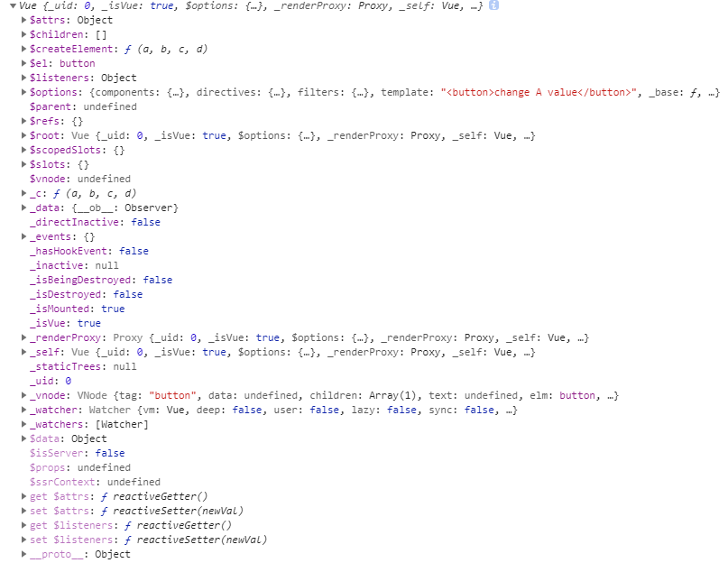
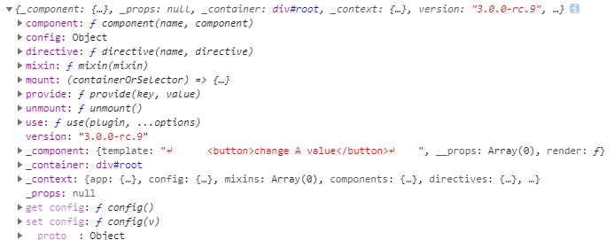

# 从vue2升级到vue3的应该做什么？

最近在升级[v-easy-components](https://linkorg.club/)到`2.0.0`版本时候，发现了一些升级过程中的问题，总结一下，希望能帮到从vue2升级到vue3的项目。

## emit 需要主动声明

在`.vue`组件中，使用`this.$emit('emitName')`时，不需要主动声明emit的第一个参数，在vue3中，必须主动声明`emits`，她接受数组，写法如下

```javascript
export default {
  template: `
    <div @click="$emit('click')"></div>
  `,
  emits: ['click']
}
```

如果不主动声明，在使用组件时监听`click`事件，会触发两次。

## v-model可以指定值，默认为modelValue

在vue2中使用`v-model`默认为value（单选框、复选框等类型的输入控件不同），在vue3中支持自定义value，可以使用`v-model:value="value"`支持vue2。也可以用`$emit('update:modelValue')`支持`v-model="value"`，这取决于你可以（愿意）修改哪部分代码。

以下为修改子组件的形式。更多信息参考[https://v3.vuejs.org/guide/migration/v-model.html#overview](https://v3.vuejs.org/guide/migration/v-model.html#overview)
```javascript
import { createApp, ref } from 'https://unpkg.com/vue@3.0.0-rc.9/dist/vue.esm-browser.js'

const App = createApp({
    template: `
      <message v-model="value" />
      <button @click="value += 1">change A value</button>
    `,
    setup: () => {
      const value = ref(0)
      return {
        value
      }
    }
})

const Message = {
  name: 'Message',
  template: `
    <div>
      <span>{{ modelValue }}</span>
      <button @click="$emit('update:modelValue', (modelValue+1))">change B value</button>
    </div>
  `,
  props: {
    modelValue: Number
  }
}

App.component(Message.name, Message)

App.mount('#root')
```

## 完全移除this.$set

vue3最大的改变之一就是使用`Proxy`。【Proxy 用于修改某些操作的默认行为，等同于在语言层面做出修改，所以属于一种“元编程”（meta programming），即对编程语言进行编程。】①

在项目架构中，分离了响应式系统，vue3中的响应式API可以剥离出来单独使用。

```javascript
import { ref, computed } from '@vue/reactivity'

const count = ref(1)
const plusOne = computed(() => count.value + 1)

console.log(plusOne.value) // 2

plusOne.value++ // error
```

## 使用config.globalProperties代替Vue.prototype

现在提倡函数式编程，Vue也抛弃了2的new形式实例化一个组件，改用`createApp`创建，所以我们不能再使用`Vue.prototype`创建组件通用方法，更改为`app.config.globalProperties.attr = () => {}`这种形式。

```javascript
// Before
Vue.prototype.$http = () => {}

// After
const app = Vue.createApp({})
app.config.globalProperties.$http = () => {}
```

## 自定义命令的改变

vue2自定义指令文档在这里[https://vuejs.org/v2/guide/custom-directive.html#Hook-Functions](https://vuejs.org/v2/guide/custom-directive.html#Hook-Functions)，vue3自定义指令文档在这里[https://v3.vuejs.org/api/application-api.html#directive](https://v3.vuejs.org/api/application-api.html#directive)。自定义指令在升级过程中暂未发现特别需要注意的地方，按照文档更新即可。

```javascript
// vue2
Vue.directive('demo', {
  bind: function (el, binding, vnode) {
    var s = JSON.stringify
    el.innerHTML =
      'name: '       + s(binding.name) + '<br>' +
      'value: '      + s(binding.value) + '<br>' +
      'expression: ' + s(binding.expression) + '<br>' +
      'argument: '   + s(binding.arg) + '<br>' +
      'modifiers: '  + s(binding.modifiers) + '<br>' +
      'vnode keys: ' + Object.keys(vnode).join(', ')
  }
})

// vue3
import { createApp } from 'vue'
const app = createApp({})

// register
app.directive('my-directive', {
  // Directive has a set of lifecycle hooks:
  // called before bound element's parent component is mounted
  beforeMount() {},
  // called when bound element's parent component is mounted
  mounted() {},
  // called before the containing component's VNode is updated
  beforeUpdate() {},
  // called after the containing component's VNode and the VNodes of its children // have updated
  updated() {},
  // called before the bound element's parent component is unmounted
  beforeUnmount() {},
  // called when the bound element's parent component is unmounted
  unmounted() {}
})
```

## nextTick的改变

在vue2中，在组件实例上可以使用`this.$nextTick`，它会在渲染之后调用。在vue3中，它变成了一个全局API，需要`import { nextTick } from 'vue'`这样引用。vue3节省了一个实例所占用js内存，以下附两张不同版本的实例截图。

Vue2


Vue3


## 使用definecomponent来进行类型推导

当项目中使用typescript时，可以使用definecomponent，它什么也不做，只会进行类型推导，让我们在使用时可以知道参数的类型。[https://v3.vuejs.org/api/global-api.html#definecomponent](https://v3.vuejs.org/api/global-api.html#definecomponent)

```javascript
import { definecomponent } from 'vue'
export default definecomponent({
  name: '',
  setup() {

  }
})
```

① [https://es6.ruanyifeng.com/#docs/proxy#%E6%A6%82%E8%BF%B0](https://es6.ruanyifeng.com/#docs/proxy#%E6%A6%82%E8%BF%B0)

更新时间：2020.09.04
